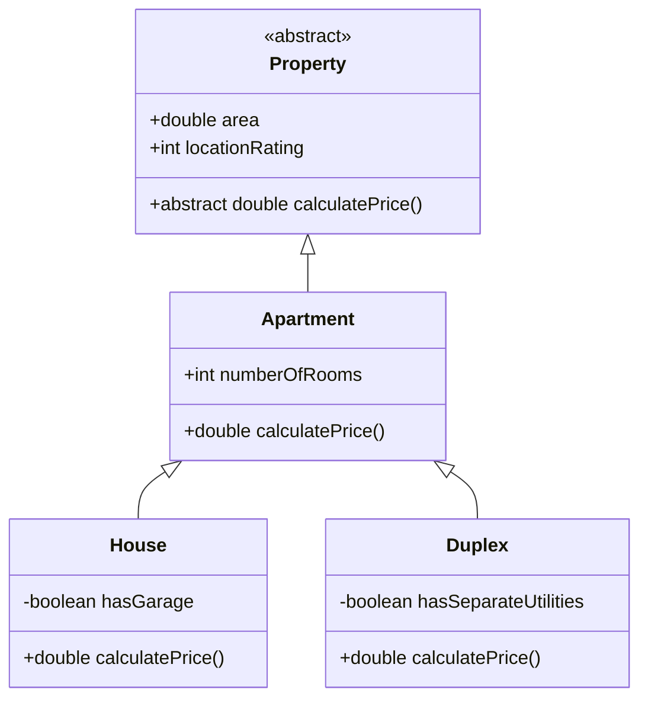
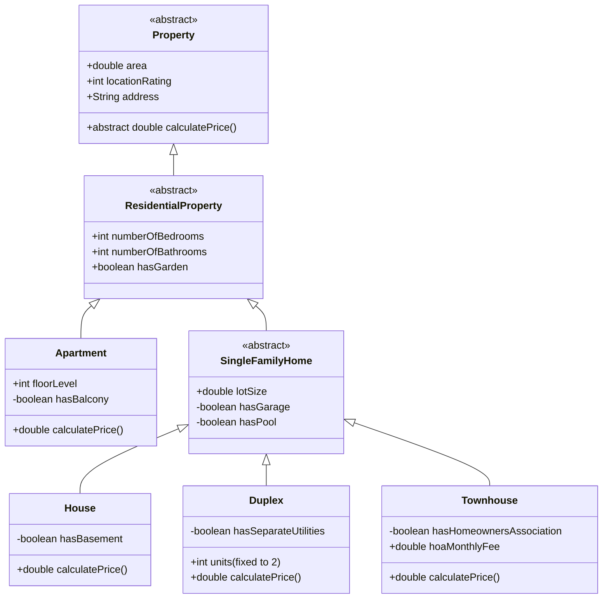

# Lab#01: Herencia de Java SE (Inheritance)
Repositorio de proyectos

Resumen
[Project Repository](https://github.com/OscarFouz/ApartmentPredictor)

## Summary

> Este laboratorio introduce conceptos fundamentales de **herencia** en Java SE hasta <mark> un modelo de dominio inmobiliario.</mark> 
> 
> Los estudiantes construirán una jerarquía de clases comenzando con un resumen  `Property` class, clase, extendiéndola a un concreto `Apartment` clase y especializarse aún más en `House` y `Duplex` subclases. 
> 
> El ejercicio enfatiza la anulación de métodos, el polimorfismo, la herencia multinivel y el uso de campos específicos de tipo para personalizar el comportamiento (particularmente en el `calculatePrice()` método).

## Referencia



Implementación base proporcionada como punto de partida:

```java
public abstract class Property {
    protected double area;
    protected int locationRating;

    public abstract double calculatePrice();
}
```

```java
public class Apartment extends Property {
    protected int numberOfRooms;

    @Override
    public double calculatePrice() {
        double basePrice = area * 120 + (numberOfRooms * 8000);
        return basePrice * (1 + (locationRating * 0.04));
    }
}
```

```java
public class House extends Apartment {
    private boolean hasGarage;

    @Override
    public double calculatePrice() {
        double basePrice = area * 180 + (numberOfRooms * 15000);
        if (hasGarage) {
            basePrice += 25000;
        }
        return basePrice * (1 + (locationRating * 0.06));
    }
}
```

```java
public class Duplex extends Apartment {
    private boolean hasSeparateUtilities;

    @Override
    public double calculatePrice() {
        double basePrice = area * 220 + (numberOfRooms * 12000);
        if (hasSeparateUtilities) {
            basePrice *= 1.15;
        }
        return basePrice * (1 + (locationRating * 0.09));
    }
}
```

## Objetivo

- Comprender y aplicar la herencia de uno y varios niveles.
- Practica la anulación de métodos y el comportamiento polimórfico.
- Utilice campos heredados y específicos de subclases de forma eficaz.
- Demuestre un diseño limpio orientado a objetos en un dominio realista.
- Aplicar <mark>Pruebas unitarias con JUnit</mark> para verificar la creación de objetos y el comportamiento del método en toda la jerarquía de herencia.

## Tareas

Los estudiantes deben hacer un  **fork** el repositorio, crea una rama personal, implementa una de las siguientes variantes y envía una **Pull Request**.

Para reforzar aún más los conceptos de herencia, sobreescritura de métodos y polimorfismo, agregue los siguientes métodos a la jerarquía. Cada método puede declararse en una superclase adecuada (a menudo abstracta) y anularse en subclases para proporcionar un comportamiento específico del tipo.

#### 1. `abstract String getPropertyType()`

**Propósito:** Devuelve un nombre de tipo legible por humanos (p.e., "Apartment", "House").  
**Colocación:** DDeclarar como abstracto en `Property`.  
**Sobrescritura:**  

- `Apartment`: devuelve "Apartment"  
- `House`: devuelve "Single-Family House"  
- `Duplex`: devuelve "Duplex (2 Unidades)"  
- `Townhouse`: devuelve "Townhouse"  
  **Unidades:** Demostración de polimorfismo simple — llamando a un `Property` La referencia muestra el tipo real.

#### 2. `double calculateAnnualPropertyTax()`

**Propósito:** Estima el impuesto a la propiedad anual en función del precio calculado y la ubicación.
**Colocación:** Declarar en `Property` on una implementación predeterminada (por ejemplo, precio × tasa impositiva base × factor de ubicación).
**Sobrescritura:**  

- `ResidentialProperty` o subclases específicas: ajustar la tasa impositiva (por ejemplo, las casas adosadas pagan más debido a la asociación de propietarios, los apartamentos pagan menos debido al mantenimiento compartido).
  **Beneficio:** Muestra cómo las subclases pueden refinar una fórmula común.

#### 3. `boolean isSuitableForFamily(int familySize)`

**Propósito:** Determina si la propiedad es adecuada para una familia de tamaño determinado. 
**Colocación:** DDeclarar en`ResidentialProperty` on lógica predeterminada (basada en bedrooms/bathrooms).
**Sobrescritura:**  

- `Apartment`: más estricto (por ejemplo, necesita al menos 1 baño por cada 3 personas).
- `House` / `Townhouse`: más indulgente + bonificación si hasGarden o hasPool.
- `Duplex`: adecuado sólo para familias más grandes/extensas. 
  **Beneficio:** Utiliza múltiples campos, incluidos los específicos de subclases.

#### 4. `double calculateRenovationCost()`

**Propósito:** Estima el costo de modernizar la propiedad.
**Colocación:** Declarar en  `ResidentialProperty`.  
**Sobrescritura:**  

- `Apartment`: menor costo (enfoque en el interior + balcón si está presente).
- `House`: superior (incluye garaje, piscina, sótano). 
- `Townhouse`: medio + extra si HOA restringe los cambios.
  **Beneficio:** Demuestra el uso significativo de campos tanto heredados como específicos.

#### 5. `String listKeyFeatures()`

**Propósito:** Devuelve una cadena formateada que enumera las características notables.
**Colocación:** Declarar en `Property` con implementación básica  (area, location, address).  
**Sobrescritura:**  

- Cada clase de hormigón añade sus propias características (p.e., House añade "Garage: Yes", "Pool: Yes", "Basement: Yes").  
  **Beneficio:** Muestra sobreescritura progresiva — cada nivel agrega más detalles.

#### 6. `double estimateRentalIncomePerMonth()`

**Propósito:** Estima los posibles ingresos mensuales por alquiler.
**Colocación:** Declarar en `ResidentialProperty` devolviendo 0 por defecto (suposición ocupada por el propietario).
**Sobrescritura:**  

- `Apartment`: cantidad moderada en función de los dormitorios y el nivel del piso.
- `Duplex`: alto (el doble de la tarifa unitaria única + bonificación si se separan las utilidades).
- `Townhouse`: similar al apartamento pero un poco más alto.
- `House`:  sobreescritura opcional si se comercializa como alquiler. 
  **Beneficio:** Fuerte ejemplo de anulación selectiva — no todas las propiedades generan ingresos por alquiler fácilmente.

#### 7. `boolean requiresHomeownersAssociation()`

**Colocación:** Declarar en`SingleFamilyHome` devolviendo false.  
**Sobrescritura:**  

- `Townhouse`: devuelve true.  
  **Beneficio:** Muestra un método relevante sólo para una rama de la jerarquía.

**Estrategia de implementación recomendada:**

- Comience agregando métodos abstractos/predeterminados en la clase más alta apropiada.
- Sobreescritura en clases concretas (y resúmenes intermedios si es necesario) utilizando `super` llamadas cuando sea posible reutilizar la lógica.
- Crea una clase de prueba que:
  - Instancia varias propiedades.
  - Los almacena en un`List<Property>` o `List<ResidentialProperty>`.
  - Realiza bucles y llama a varios de estos métodos de forma polimórfica.
  - Imprime los resultados para mostrar claramente diferentes comportamientos para la misma llamada al método.
  - 
## UML enhaced

**Objective:** Construya una jerarquía de herencia más sofisticada para propiedades inmobiliarias, introduciendo una mayor complejidad a través de abstracción adicional, subclases más especializadas, nuevos campos en diferentes niveles y una lógica de cálculo de precios más rica. Este ejercicio refuerza la herencia multinivel, la anulación de métodos, el polimorfismo y el modelado de dominios realista.

**Nueva jerarquía de clases (Mermaid UML):**



**Mejoras clave y complejidad añadida:**

- **Property** (resumen de nivel superior): ahora incluye la dirección String para mayor realismo.
- **ResidentialProperty** (nueva clase abstracta intermedia): agrupa características residenciales comunes (numberOfBedrooms, numberOfBathrooms, hasGarden) scompartidas por apartments y single-family homes.
- **Apartment**: ahora tiene pisoNivel y privado tieneBalcón — pisos superiores y balcones agregan valor.
- **SingleFamilyHome** (nueva subclase abstracta): presenta las características lotSize, hasGarage y hasPool — típicas de los hogares independientes.
- Tres subclases concretas en SingleFamilyHome:
  - **House**: unifamiliar tradicional con hasBasement opcional.
  - **Duplex**: ffijo 2 unidades, utiliza hasSeparateUtilities.
  - **Townhouse** (nuevo): casa adjunta con hasHomeownersAssociation and hoaMonthlyFee (que reduce el valor neto).

**Ideas lógicas sugeridas decalculatePrice()**

- Base El precio base siempre tiene en cuenta area, locationRating, numberOfBedrooms, y numberOfBathrooms.
- **Apartment**: los niveles de piso más altos aumentan el precio; el balcón agrega prima.
- **House**: lote grande, garaje, piscina, sótano y jardín aumentan significativamente el valor.
- **Duplex**: potencial de ingresos por alquiler — base más alta por pie cuadrado + bonificación si se separan los servicios públicos.
- **Townhouse**: similar a la casa pero reducido por las tarifas de la asociación de propietarios (por ejemplo, restar la tarifa anualizada del valor).
- 
## Deliverables

1. **Fork** el repositorio: https://github.com/AlbertProfe/ApartmentPredictor
2. **Clone** su forked repositorio local.
3. Crea un nuevo **branch** llamasdo`lab01-yourGitHubUsername`.
4. Implementar **solo una** de las 7 variantes de tareas (indique claramente qué variante en el mensaje de confirmación y la descripción de PR).
5. Commit and push tus cambios.
6. Abrir un **Pull Request** de tu rama a  la rama origin `master`.
7. En la descripción PR, incluir:
   - Número y título de la variante
   - Breve explicación de los cambios
   - Captura de pantalla o salida de la ejecución del programa

¡Buena suerte!
